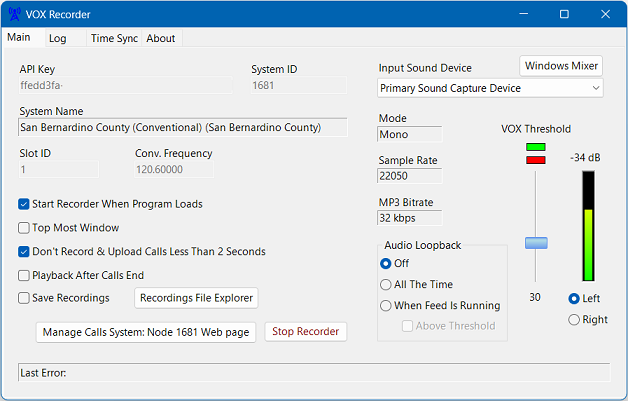

# VOX Recorder

VOX Recorder is an application specifically designed for the [Broadcastify Calls](https://www.broadcastify.com/calls/) platform. Connect a receiver tuned to a specific conventional frequency.
The recorder starts when the audio level goes above the VOX Threshold. The recorder stops when the audio goes back below the VOX threshold (after 2 seconds of no audio).

The recorded audio is converted to MP3 then ID3v2 metadata is inserted then finally sent to the Broadcastify Calls platform. The recordings are also saved to the hard drive if optioned.



## System Requirements
- Operating System - Windows 7 SP1 and above. VOX Recorder targets the Microsoft .NET Framework 4.8
- Audio input device - Sound card or USB audio adapter
- Internet Connection

## Getting Started
- Apply for an API Key and System ID - Submit an application here: [Calls Ingest Application Process](https://www.broadcastify.com/apply/calls)
- Install VOX Recorder
  - Download [Version 0.5.0 Setup File](https://github.com/BobAProScan/VOX-Recorder/releases/download/v0.5.0/VOX_Recorder_0_5_0_Setup.zip)
  - Open the .zip file
  - Click the exe setup file and follow the prompts
- [Audio Setup](#audio-setup)
- [Configuring VOX Recorder](#configuring-vox-recorder)
- Start the Recorder

Note:
There is never a need to uninstall VOX Recorder if another version of VOX Recorder is installed prior to installing the new version.  The existing configuration and logging files will be retained after installation provided the new version is installed in the same folder.

## Audio Setup
For reference, see the article: https://wiki.radioreference.com/index.php/Connecting_Radios_to_Soundcards

Use an audio cable with 1/8inch (3.5mm) stereo plugs. Connect the audio cable from the receiver audio output jack to the computer's audio input jack.
Tune the receiver to a conventional frequency.
Go to the Windows Mixer Recording tab. To get to it easy, click the Win Mixer button on the main tab in the upper right corner.
In the Win Mixer, check that the input is enabled and does not show as not plugged in.
If using the mic input with Win 10 or Win 11 then check the microphone privacy settings and allow VOX Recorder access.
In the Win Mixer, ensure that the audio level controls are adjusted correctly. If using the mic input then the level control should be turned way down to minimize distortion unless it auto compensates.
In VOX Recorder, select the Input Sound Device. In most cases, this will be the Primary Sound Device which is the 1st item in the selection.
In VOX Recorder, select the left or right channel.
In VOX Recorder, turn on the Loopback "All The Time" option with the "Above Threshold" box unchecked for the next step.
Turn the receiver volume up until you hear distortion then back off about 10%.
Close the Win Mixer.
Adjusting the VOX Threshold,  - When no traffic is present, move the threshold slider a bit above the noise floor.

The audio format sent to the Broadcastify Calls platform and the recordings saved to hard drive are Mono, 22,050 samples per second, 32 kbps MP3 Bitrate, 16 bits

## Configuring VOX Recorder

- API Key - Assigned by the Broadcastify Calls administrator.
- System ID - Assigned by the Broadcastify Calls administrator.
- System Name - This box is read only and is linked to the API Key and System ID.
- Slot ID - Set to 1 when running a single instance of VOX Recorder. If running multiple instances using the same System ID and API Key then each conventional frequency is assigned a Slot ID starting with 1.
- Conv. Frequency - Input the frequency that the receiver is tuned to. It needs to be part of the same system.

The checkboxes options should be self-explanatory.

## Operation
After the audio has been setup and good audio levels and the VOX Threshold is set then click the "Start Recorder" button. 
The recording will upload after the audio goes back below the VOX threshold after a 2 second delay to ensure that the conversation has ended. The last 2 seconds of audio will delete as that is dead air.

If continuous audio is detected for 2 minutes due to interference, open mic, etc. then the recording will stop and not upload.

VOX Recorder will send a keep-alive poll at 10 minute intervals to prevent the Broadcastify Calls platform from showing your feed offline.

## Recorder
If the "Save Recordings" box is checked then the recordings are saved to the "Recordings" folder under the folder containing VOX Recorder.
The recordings are named using the Epoch time format.
ID3v2 Metadata is inserted in the MP3 file. Any Media Player that supports reading ID3v2 tags should show the metadata.
```
The following ID3 tags are used
        TPE1 - Conv. Frequency (Artist)
        TCON - Receiver Audio (Genre)
        TPUB - ProScan (Publisher)
        TCOM - VOX Recorder & Version (Composer)
        TYER - Year Created (year)
        COMM - Date & Time, System, Conv. Frequency (Comment)
```
## Logging
The Logging tab grid will show all errors, e.g., duplicate calls, no API key specified, 2 minute timeout, etc. The logging grid clears when the app starts. To see the last 1000 errors, click the "View Text Log" button.

## Time Sync
At 10 minute intervals, TimeSync will retrieve the actual time from a time server and compare it with the computer time. The result is an offset variable that is used to calculate the recording's actual start time. 

## Frequently Asked Questions

Q: <b>Can I run multiple copies of VOX Recorder on one computer?</b><br>
A: Yes.  Many instances of VOX Recorder can run on the same computer.  1) Copy the contents of an existing folder to a new folder.  2) Run VOX Recorder in the new folder then change the options specific to that instance.<br>

Q: <b>How can I stream multiple receivers at the same time?</b><br>
A: By running multiple instances of VOX Recorder.<br>

Q: <b>How can VOX Recorder automatically start sending calls after the computer reboots?</b><br>
A: Add a VOX Recorder shortcut to the Windows Startup folder.  Ensure the option 'Start Recorder When Program Loads' is checked.<br>

Q: <b>Should I run VOX Recorder as administrator?</b><br>
A: It's recommended that VOX Recorder is not elevated to administrator.<br>
